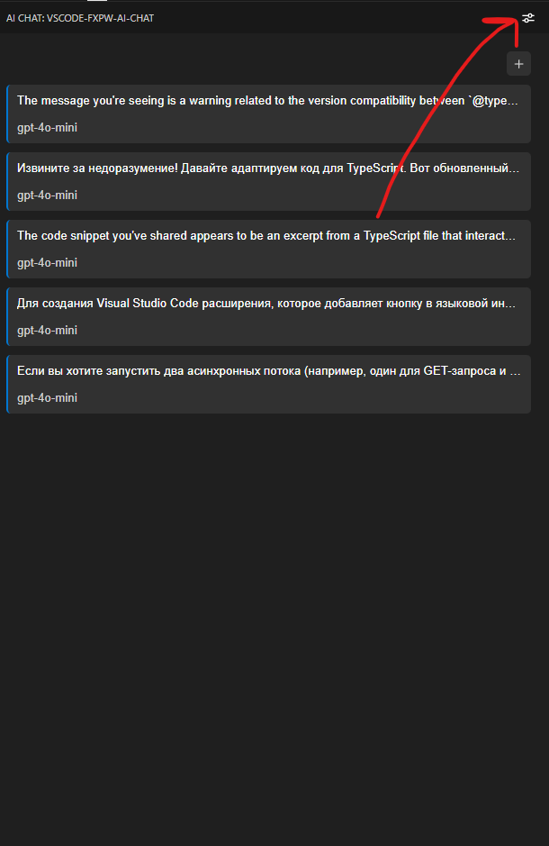

# fxpw-ai-chat README

> Openai text requests chats whit proxy support

> Proxy setting on extension settings or click on button(see screen)

> If you have troubles whit cloudflare disable vscode proxy

# Features

More things whit openai

# Release Notes

### 1.0.40-1.1.47

add auto create commit feature whit api vscode.git

### 1.0.15-1.0.16

### 1.0.34-1.1.40

add editor to input and save inputed text

### 1.0.28-1.0.34

add new gpt, update settings icon

### 1.0.18-1.0.28

add new gpt

### 1.0.15-1.0.17

add command to delete chats, fix bug whit openai error block

### 1.0.8-1.0.14

imporove autobuild and logic for chats

### 1.0.7

add command from rmb, imporove logic for delete button

### 1.0.5-1.0.6

improve logic for send to many chats, add more styles

### 1.0.2-1.0.4

cleanup

### 1.0.1

add logic for save chat data and reuse it in chats

### 0.0.10

change styles

### 0.0.9

fix logic

### 0.0.8

fix params

### 0.0.1-0.0.7

Init and test things
